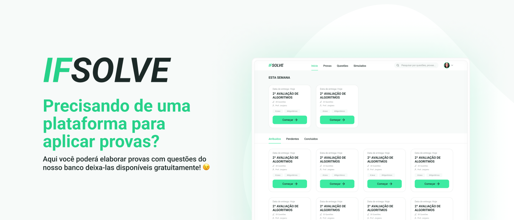

 
<h1 align="center" style="font-style: italic; font-weight:bold;"><b style="color: #26D189;">IF</b>SOLVE</h4>
<h4 align="center"> 👨‍💻 Em desenvolvimento 👩‍💻 </h4>
<p align="center">
 <a href="#descrição-do-projeto">Descrição do projeto</a> • 
 <a href="#tecnologias">Tecnologias</a> • 
 <a href="#setup">Setup</a> • 
 <a href="#documentação">Documentação</a> •
 <a href="#autores">Autores</a> 
</p>

# Descrição do projeto
O sistema web IFSolve tem como objetivo atuar como um banco de questões que visa contribuir no âmbito acadêmico, permitindo a professores a elaboração e aplicação de avaliações, e estudantes no processo de aprendizagem com a prática de simulados e exercícios de diferentes áreas do conhecimento.

Este é um projeto desenvolvido durante o curso de TADS (Tecnologia em Análise e Desenvolvimento de Sistemas) do IFRN-CNAT.
# Tecnologias
## Front-end
As seguintes ferramentas foram usadas na construção do projeto front-end:
- [React](https://pt-br.reactjs.org/)
- [Node.js](https://nodejs.org/en/)
> Veja o arquivo package.json

## Back-end
As seguintes ferramentas foram usadas na construção do projeto back-end:
> Tecnologias usadas no back-end?

# Setup
## Pré-requisitos

Para executar o projeto você vai precisar ter instalado em sua máquina as seguintes ferramentas:
- E um editor para trabalhar com o código [VSCode](https://code.visualstudio.com/)
- [Git](https://git-scm.com)
- [Node.js](https://nodejs.org/en/)
- [Yarn](https://yarnpkg.com/) 

### Executando o projeto back-end
>Descrição de como instalar e iniciar a aplicaçao back-end


### Executando o projeto front-end

```bash
# Clone este repositório
$ git clone git@github.com:tads-cnat/ifsolve.git

# Acesse o diretório do front-end
cd .\frontend\

# Baixe as dependências
yarn install ou npm install

# Inicie a aplicação
yarn start ou npm start
```

# Documentação

>Link para os documentos do projeto

# Autores

<table style>
  <tr>
    <td align="center"><a href="https://github.com/alcides07">
        
        <br />
        <a href="https://github.com/alcides07"><b>Alcides Dantas</b></a>
    </td>
    <td align="center"><a href="https://github.com/diogoodiego">
        
        <br />
        <a href="https://github.com/diogoodiego"><b>Diogo Santos</b></a>
    </td>
    <td align="center"><a href="https://github.com/erick003">
        
        <br />
        <a href="https://github.com/erick003"><b>Erick Carlos</b></a>
    </td>
  </tr>
  <tr>
    <td align="center"><a href="https://github.com/IsraelKleber">
        
        <br />
        <a href="https://github.com/IsraelKleber"><b>Israel Kleber</b></a>
    </td>
    <td align="center"><a href="https://github.com/Livia-Rachell">
        
        <br />
        <a href="https://github.com/Livia-Rachell"><b>Lívia Rachel</b></a>
    </td>
    <td align="center"><a href="https://github.com/matRaph">
        
        <br />
        <a href="https://github.com/matRaph"><b>Raphael Matias</b></a>
    </td>
  </tr>
</table>