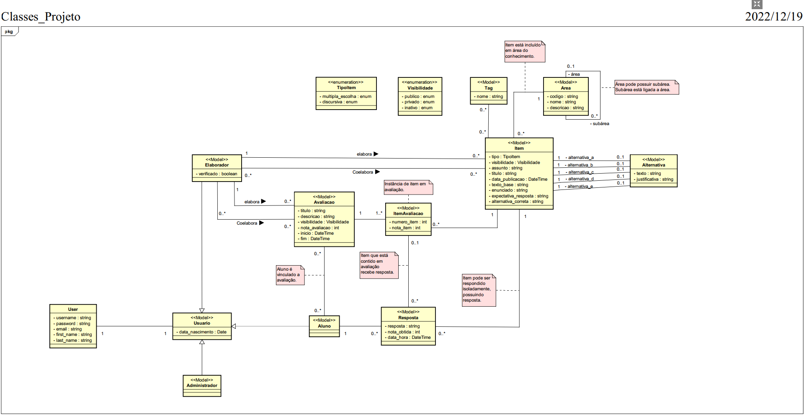
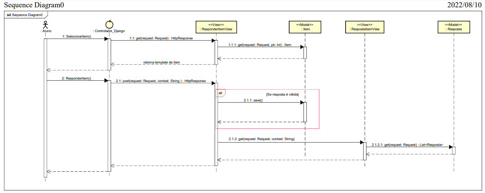

# IFSolve

### **Documento de Arquitetura do Sistema**

**Histórico da Revisão**

| Data | Versão | Descrição | Autor |
| --- | --- | --- | --- |
| 22/01/2023 | 1.0 | Versão inicial | Israel |
| 26/01/2023 | 1.1 | Inclusão do tópico 6 | Israel |
| 26/01/2023 | 1.2 | Inclusão do tópico 4 | Erick |
| 27/01/2023 | 1.3 | Inclusão do tópico 7.3 | Alcides |

# 1. Introdução

O IFSolve é uma plataforma web desenvolvida para contribuir com o âmbito acadêmico, permitindo aos professores a elaboração e aplicação de itens e avaliações, e estudantes no processo de aprendizagem com a prática de simulados e itens de diferentes áreas do conhecimento.

# 2. Termos e Abreviações

- **Item**: Questão criada pelo usuário do tipo elaborador para ser aplicada em uma avaliação ou disponibilizada publicamente para que os alunos possam exercitar seu conhecimento sobre aquele assunto.
- **Avaliação:** exame desenvolvido pelo usuário do tipo elaborador para testar o conhecimento adquirido pelos seus alunos.
- **Aluno:** Usuário cadastrado no sistema responsável por responder itens e avaliações.
- **Elaborador:** Usuário cadastrado no sistema responsável por elaborar itens e avaliações.
- **Administrador:** Usuário responsável por gerenciar alunos, elaboradores, itens, avaliações e validação dos novos usuários cadastrados como elaborador.

# 3. Descrição de Requisitos

## 3.1 Requisitos Funcionais

| Código | Nome | Descrição |
| --- | --- | --- |
| RF05 | Elaboração de item (Elaborador) | Um elaborador submete um item para o sistema. |
| RF06 | Exclusão de item (administrador) | Um administrador pode excluir um item do sistema que ainda não foi inserido em uma avaliação. |
| RF09 | Elaboração de avaliação (elaborador) | Um elaborador seleciona um conjunto de itens da plataforma e faz uma nova avaliação no sistema, configurando seu nível de acesso inicial. |
| RF10 | Exclusão de avaliação (elaborador autor) | Um elaborador apaga de forma definitiva uma avaliação do sistema. |
| RF13 | Associação de usuário <-> avaliação | Um elaborador pode vincular quais alunos podem realizar uma determinada avaliação. |
| RF14 | Realização de avaliação | Um aluno inicia uma avaliação disponível (dentro do prazo) e que está vinculada a ele. Avaliações do tipo simulado não possuem prazo. |
| RF16 | Cadastro de resultado em uma avaliação (elaborador autor) | Um elaborador pode gerar um retorno (nota, mensagem etc.) sobre a avaliação de um usuário. |

## 3.2 Atributos de qualidade

| ID | Atributo de qualidade | Motivação |
| --- | --- | --- |
| 1 | Autenticação de usuários para realizar login no sistema. | Segurança |
| 2 | Apenas o elaborador pode criar item e avaliação. | Segurança |
| 3 | Apenas o aluno pode responder item e avaliação. | Segurança |
| 4 | O elaborador só tem acesso aos itens criados por ele e os com status público. | Segurança |
| 5 | O elaborador só pode excluir um item de sua autoria se este ainda não foi inserido em uma avaliação. | segurança |

## 3.3. Stakeholders

| Papel | Interesse |
| --- | --- |
| Aluno | Tem interesse em uma plataforma que possibilita testar seus conhecimentos através de resolução de itens, simulados e provas. |
| Professor | Tem interesse em uma plataforma que possibilita elaborar itens, avaliações e realizar a aplicação destas para os alunos. |
| Desenvolvedor | Tem interesse em desenvolver uma plataforma intuitiva e prática, atendendo as necessidades dos usuários, seguindo boas práticas de desenvolvimento. |

# 4. Restrições Arquiteturais

## 4.1 Restrições técnicas

|  | Restrição | Contexto e/ou Motivação |
| --- | --- | --- |
| Restrição de software e programação |  |  |
| RT1 | Acessibilidade | Nossa plataforma não dispõe de ferramentas que auxiliam pessoas com deficiência visual. |
| RT2 | Sistema Docker | Faz-se necessário o uso do sistema Docker para executar o backend do IFSolve. |
| Restrição de sistema operacional |  |  |
| RT3 | Compatibilidade | Se o sistema operacional não é compatível com o software ou as bibliotecas utilizadas pelo aplicativo, isso pode causar problemas de compatibilidade. |
| RT4 | Segurança | Se o sistema operacional não fornecer suporte a certas medidas de segurança, como criptografia ou autenticação, isso pode deixar o aplicativo vulnerável a ataques. |
| Restrições de Hardware |  |  |
| RT5 | Conectividade de rede | Se a conectividade de rede é limitada, isso pode afetar a velocidade e a disponibilidade do aplicativo. |

# 5. Escopo do Sistema e Contexto

## 5.1 Diagrama de Casos de Uso

| CDU | Objetivo | Ator Primário | Implementação |
| --- | --- | --- | --- |
| CDU01 - Elaborar item | O elaborador pode criar itens. | Elaborador | Sim |
| CDU02 - Visualizar item | O elaborador pode visualizar os itens criados por ele e os que estão públicos desenvolvidos por outros elaboradores. Já o aluno só pode visualizar os itens públicos. | Aluno e Elaborador | Sim |
| CDU03 - Responder item | O aluno pode responder os itens que estão disponíveis(públicos). | Aluno | Sim |
| CDU04 - Visualizar respostas de um item | O aluno pode visualizar as respostas dadas por ele a um item. | Aluno | Sim |
| CDU05 - Realizar login | Os usuários do tipo aluno e elaborador podem realizar login no sistema. | Aluno e Elaborador | Sim |
| CDU06 - Realizar logout | Os usuários do tipo aluno e elaborador podem realizar logout no sistema. | Aluno e Elaborador | Sim |
| CDU07 - Elaborar avaliação | O elaborador pode criar  avaliações. | Elaborador | Sim |
| CDU08 - Visualizar avaliação | O elaborador pode visualizar as avaliações criadas por ele e as avaliações em que ele foi posto como coelaborador. Já o aluno só pode visualizar as avaliações em que foi incluído. | Aluno e Elaborador | Sim |
| CDU09 - Aplicar avaliação | O elaborador seleciona os alunos que irão realizar a avaliação. | Elaborador | Sim |
| CDU10 - Realizar autocadastro | O usuário que deseja ter uma conta no IFSolve pode realizar o autocadastro. | Todos os usuários | Sim |
| CDU11 - Responder avaliação | O aluno pode responder às avaliações em que foi incluído. | Aluno | sim |
| CDU12 - Visualizar resposta em avaliação | O elaborador pode visualizar as respostas dadas pelos alunos em uma avaliação. Por outro lado, o aluno pode visualizar suas respostas fornecidas a uma avaliação, contendo os acertos, erros e as respectivas notas obtidas em cada item. | Aluno e Elaborador | Sim |
| CDU13 - Avaliar resposta em avaliação | O elaborador pode atribuir notas às respostas dadas pelos alunos em uma avaliação. | Elaborador | Sim |
| CDU14 - Visualizar simulado | O aluno pode visualizar os simulados que ele solicitou que o sistema gere automaticamente. | Aluno | Não |
| CDU15 - Realizar simulado | O aluno pode responder os simulados que ele solicitou que o sistema gere automaticamente. | Aluno | Não |
| CDU16 -  Editar Item | O elaborador pode editar os itens criados por ele e que ainda não foram aplicados em uma avaliação. | Elaborador | Não |
| CDU17 - Editar avaliação | O elaborador pode editar uma avaliação se ela ainda não foi aplicada. | Elaborador | Não |
| CDU18 - Validar elaborador | O administrador pode aceitar ou não o cadastro de um usuário que deseja ser elaborador. | Administrador | Não |

# 6. Diagramas Conceituais    

## 6.1 Visão Lógica

### **Modelos de domínio**
 

| Conceito | Descrição |
| --- | --- |
| User | Mantém informações sobre o User padrão do Django. |
| Usuário | Mantém informações sobre todos os usuários que possuem cadastro no sistema. |
| Aluno | Mantém informações sobre o usuário do tipo aluno. |
| Elaborador | Mantém informações sobre o usuário do tipo elaborador. |
| Administrador | Mantém informações sobre o usuário do tipo administrador. |
| Item | Mantém informações sobre questões incluídas no sistema. |
| TipoItem | Mantém informações sobre o tipo (múltipla escolha ou discursiva) de um item. |
| Alternativa | Mantém informações sobre as alternativas criadas vinculadas a um item de múltipla escolha. |
| Área | Mantém informações sobre a área de conhecimento e subárea vinculada a um item. |
| Tag | Mantém informações sobre tags vinculadas a um item. |
| Visibilidade | Mantém informações sobre a visibilidade (pública ou privada) de um item. |
| Avaliação | Mantém informações sobre avaliações incluídas no sistema. |
| ItemAvaliação | Mantém informações sobre os itens incluídos em uma avaliação. |
| Resposta | Mantém informações sobre as respostas dadas a itens e avaliações pelo usuário do tipo aluno. |

### **Modelo comportamental**

#### **Cenário 1: Cadastrar Item**

É representado no diagrama de sequência acima o CDU de cadastrar item realizado pelo usuário do tipo elaborador.

#### **Cenário 2: Responder Item**

É representado no diagrama de sequência acima o CDU de responder item realizado pelo usuário do tipo aluno.

# 7. Detalhamento da Implementação e Ambiente Físico  

## 7.1 Visão de Implementação
  
[Inserir diagrama de componentes]

[Listar os componentes e suas respectivas responsabilidades]

| Componente | Responsabilidades |
| --- | --- |
|  |  |
|  |  |

## 7.2 Visão de Distribuição

[Inserir o diagrama de Implantação]

[Inserir uma descrição breve de cada nó]

## 7.3 Persistência

### **Modelo de Domínio *versus* Modelo Relacional**

| Classe | Tabela | Significado |
| --- | --- | --- |
| User | User | Classe User do Django utilizada para se relacionar com a classe Usuario. |
| Usuario | Usuario | Todos os usuários cadastrados no sistema. |
| Administrador | Administrador | Usuário com maior hierarquia sobre o sistema. |
| Elaborador | Elaborador | Usuário que pode cadastrar item e avaliação. |
| Aluno | Aluno | Usuário que pode responder item e avaliação. |
| Item | Item | Questão cadastrada no sistema. |
| Area | Area | Área de conhecimento de um item. |
| Tag | Tag | Termo(s) relacionado(s) ao conteúdo de um item. |
| Alternativa | Alternativa | Opção de resposta de item do tipo múltipla escolha. |
| Avaliacao | Avaliacao | Prova a ser respondida pelo aluno. |
| ItemAvaliacao | ItemAvaliacao | Item contido em uma avaliação. |
| Resposta | Resposta | Resposta fornecida pelo aluno a um item ou avaliação. |

> O SGDB utilizado foi PostgreSQL, devido a sua boa escalabilidade, flexibilidade e robustez, de modo a persistir os dados dos itens que estão contidos em uma avaliação, assim como as respostas fornecidas pelo aluno a um item ou avaliação, por exemplo. O ORM utilizado foi o do Django, responsável por fazer a conexão entre o banco de dados relacional e a linguagem de programação Python, criando uma camada de abstração entre as tabelas do banco de dados e as classes Python que representam essas tabelas, permitindo que seja possível manipular essas classes para fazer operações de CRUD no banco de dados. Além disso, fornece recursos avançados como relacionamentos entre tabelas, filtragem, ordenação, agrupamento e paginação de dados, e também tem suporte a vários outros bancos de dados.

## 7.4 Interface de Usuário

### **Tecnologias utilizadas**

| Tecnologia | Motivação |
| --- | --- |
| Reactjs | A equipe tem certo conhecimento com o react, “facilitando” o desenvolvimento. E por ser um dos frameworks mais populares e amplamente utilizados no mundo do desenvolvimento web, o que significa que há uma grande comunidade e muitos recursos e ferramentas disponíveis. |
| React Router Dom | Framework obrigatório para realizar redirecionamento e troca de componentes em tela, tem objetivo de auxiliar no desenvolvimento de uma SPA(Single page application). |
| Tailwind | Auxiliar na estilização dos componentes. |
| Quill | Utilizada para utilização de Rich Text Editors no enunciado de itens. |
| Formik | Utilizado para auxiliar o desenvolvimento de componentes de formulário. |
| Yup | Utilizado para validação de dados dos formulários. |
| React Hot Toast | Utilizado para gerar alertas Toast. |

### **Componentes de terceiros**

| Biblioteca | Motivação |
| --- | --- |
| React Router Dom | createBrowserRouter; RouterProvider; useNavigate; |
| Quill | ReactQuill; |
| Formik | FieldArray; useFormik; FormikProvider; |
| Yup | * |
| React Hot Toast | toast; Toaster; |

# 8. Anexos

## 8.1 API do Projeto

| URL | Descrição | Método HTTP | Tipo retorno | Exemplo de Retorno |
| --- | --- | --- | --- | --- |
| http://127.0.0.1:8000/aluno/todos | Retornar todos os alunos cadastrados | GET | ARRAY | [{"username": "string", "email": "user@example.com", "nascimento": "2019-08-24", "nome_completo": "string" }] |
| http://127.0.0.1:8000/aluno/cadastro | Cadastrar um aluno | POST | Objeto | {"username": "string", "email": "user@example.com", "nascimento": "2019-08-24", "nome_completo": "string" } |
| http://127.0.0.1:8000/area | Retornar todas as áreas cadastradas | GET | ARRAY | [{"id": 0, "codigo": "string", "nome": "string", "descricao": "string", "subarea_de": 0 }] |
| http://127.0.0.1:8000/auth/suap/auth_register | Gerar o token de usuário | POST | Objeto | {"token": "string" } |
| http://127.0.0.1:8000/auth/logout | Remover o token do usuário do banco de dados | GET | Código de Status |  |
| http://127.0.0.1:8000/auth/user | Retornar os dados do usuário logado | GET | Objeto | {"id": 0, "username": "string", "email": "email@email", "extra_data": { "tipo_usuario": "string", “nome_completo”: “string }} |
| http://127.0.0.1:8000/avaliacao/elaborador/criar | Criar uma avaliação | POST | Objeto | {"itens": [{"numero_item": -2147483648, "nota_item": -2147483648, "item": 0, "avaliacao": 0 }], "titulo": "string", "descricao": "string", "data_inicio": "2019-08-24T14:15:22Z", "data_fim": "2019-08-24T14:15:22Z", "nota": -2147483648, "visibilidade": "PU", "elaborador": "string", "co_elaboradores": ["string"], "alunos": ["string"]} |
| http://127.0.0.1:8000/avaliacao/elaborador/listar | Listar as avaliações do elaborador logado | GET | ARRAY | [{"id": 0, "itens": [{ "id": 0, "numero_item": -2147483648, "nota_item": -2147483648, "item": 0, "avaliacao": 0 }], "titulo": "string", "descricao": "string", "data_inicio": "2019-08-24T14:15:22Z", "data_fim": "2019-08-24T14:15:22Z", "nota": -2147483648, "visibilidade": "PU", "elaborador": "string", "co_elaboradores": ["string"], "alunos": ["string"]}] |
| http://127.0.0.1:8000/avaliacao/aluno/listar | Listar as avaliações que o aluno logado está inserido | GET | ARRAY | [{"id": 0, "itens": [{ "id": 0, "numero_item": -2147483648, "nota_item": -2147483648, "item": 0, "avaliacao": 0}], "titulo": "string", "descricao": "string", "data_inicio": "2019-08-24T14:15:22Z", "data_fim": "2019-08-24T14:15:22Z", "nota": -2147483648, "visibilidade": "PU", "elaborador": "string", "co_elaboradores": ["string"], "alunos": ["string"]}] |
| http://127.0.0.1:8000/avaliacao/{id}/detalhe | Retornar os dados da avaliação especificada | GET | ARRAY | {"id": 0, "itens": [{"id": 0, "numero_item": -2147483648, "nota_item": -2147483648, "item": 0, "avaliacao": 0}], "titulo": "string", "descricao": "string", "data_inicio": "2019-08-24T14:15:22Z", "data_fim": "2019-08-24T14:15:22Z", "nota": -2147483648, "visibilidade": "PU", "elaborador": "string", "co_elaboradores": ["string"], "alunos": ["string"]} |
| http://127.0.0.1:8000/avaliacao/responder | Gerar respostas de um aluno para uma avaliação | POST | Objeto | {"itens": [{"numero_item": -2147483648, "nota_item": -2147483648, "item": 0, "avaliacao": 0}], "titulo": "string", "descricao": "string", "data_inicio": "2019-08-24T14:15:22Z", "data_fim": "2019-08-24T14:15:22Z", "nota": -2147483648, "visibilidade": "PU", "elaborador": "string", "co_elaboradores": ["string"], "alunos": ["string"]} |
| http://127.0.0.1:8000/avaliacao/{id}/respostas | Retornar todas as respostas da avaliação especificada | GET | ARRAY | [{"id": 0, "itens": [{"id": 0, "numero_item": -2147483648, "nota_item": -2147483648, "item": 0, "avaliacao": 0}], "titulo": "string", "descricao": "string", "data_inicio": "2019-08-24T14:15:22Z", "data_fim": "2019-08-24T14:15:22Z", "nota": -2147483648, "visibilidade": "PU", "elaborador": "string", "co_elaboradores": ["string"], "alunos": ["string"]}] |
| http://127.0.0.1:8000/avaliacao/{id}/aluno/{id_aluno}/respostas | Retornar as respostas de um aluno para a avaliação especificada | GET | ARRAY | [{"id": 0, "itens": [{ "id": 0, "numero_item": -2147483648, "nota_item": -2147483648, "item": 0, "avaliacao": 0}], "titulo": "string", "descricao": "string", "data_inicio": "2019-08-24T14:15:22Z", "data_fim": "2019-08-24T14:15:22Z", "nota": -2147483648, "visibilidade": "PU", "elaborador": "string", "co_elaboradores": ["string"], "alunos":["string"]}] |
| http://127.0.0.1:8000/avaliacao/{id}/aluno/respostas | Retornar as respostas do aluno logado para a avaliação especificada | GET | ARRAY | [{"id": 0, "itens": [{ "id": 0, "numero_item": -2147483648, "nota_item": -2147483648, "item": 0, "avaliacao": 0}], "titulo": "string", "descricao": "string", "data_inicio": "2019-08-24T14:15:22Z", "data_fim": "2019-08-24T14:15:22Z", "nota": -2147483648, "visibilidade": "PU", "elaborador": "string", "co_elaboradores": ["string"], "alunos": [ "string"]}] |
| http://127.0.0.1:8000/item/{id} | Retornar as respostas do aluno logado para um item especificado | GET | ARRAY | [{"id": 0, "resposta": "string", "nota_obtida": -2147483648, "data_hora": "2019-08-24T14:15:22Z", "aluno": "string", "item": 0, "item_avaliacao": 0}] |
| http://127.0.0.1:8000/tag/item/{id} | GET | Retornar todos as tags de um item especificado | ARRAY | [{"id": 0, "nome": "string"}] |
| http://127.0.0.1:8000/tag/item/{id} | POST | Criar tags para um item especificado | Objeto | {"nome": "string"} |

## 8.2 API Externa

| URL | Descrição | Método HTTP | Tipo Retorno | Exemplo de Retorno |
| --- | --- | --- | --- | --- |
| https://suap.ifrn.edu.br/api/v2/autenticacao/token/ | Gerar token de usuário do SUAP | POST | Objeto | {"refresh": "string", "access": "string"} |
| https://suap.ifrn.edu.br/api/v2/minhas-informacoes/meus-dados/ | Retornar os dados do usuário a partir do token de acesso | GET | Objeto | {"id": 0, "matricula": "string", "nome_usual": "string", "cpf": "0", "rg": "string ", "filiacao": [“string”, “string”], "data_nascimento": "2010-01-01", "naturalidade": "string", "tipo_sanguineo": "string", "email": "user@example.com", "url_foto_75x100": "string", "url_foto_150x200": "string", "tipo_vinculo": "string", "vinculo": {"matricula": "string", "nome": "string", "curso": "string", "campus": "string", "situacao": "string", "cota_sistec": "string", "cota_mec": "string", "situacao_sistemica": "string", "matricula_regular": false, "linha_pesquisa": string, "curriculo_lattes": "string"}} |

# Referências

[1] [https://biking.michael-simons.eu/docs/index.html](https://biking.michael-simons.eu/docs/index.html)

[2] [https://hsc.aim42.org/documentation/hsc_arc42.html](https://hsc.aim42.org/documentation/hsc_arc42.html)

[3] [https://resources.sei.cmu.edu/library/asset-view.cfm?assetID=513862](https://resources.sei.cmu.edu/library/asset-view.cfm?assetID=513862)

[4] [http://static.codingthearchitecture.com/documenting-software-architecture.pdf](http://static.codingthearchitecture.com/documenting-software-architecture.pdf)
